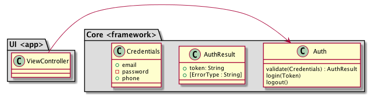

# ArgusAuth

Argus authentication module for the Swift-iOS-Xcode environment.

## Features

The authentication module provides a validation feature to support Argus login validation, initially for email and password strings.  It is based on a workshop done in the July 25th, 2018 Learning Swift Boston meet-up, specifically to use TDD to write code that will provide authentication features to validate a given email address and password.

### Email Validation

Rather than use a simple validation rule (must have @ and . in the string) I opted to use a third party validator referenced from Stack Overflow --- [ValidationComponents](https://github.com/nsgora/validation-omponents).  [Carthage](https://github.com/Carthage/Carthage) was selected as the dependency manager over Cocoa Pods since the latter is more "magic" and puts the code at risk in that the project meta data is modified in ways that might negatively impact other projects.

### Password Validation

### UI Thoughts

Rather than enable/disable the submit/login button on a login form, this code embraces an annotation approach to handling errors.  Specifically the validate() method will return information to a UI implementation that will allow the UI code to annotate the email and password fields with any relevant diagostics when errors are detected.  This is a better approach than having the User "guess" what the rules are or have a "legend" provided with the rules. Simpler and less clutter, yet easily expandable.

### Partitioning

As Argus grows to match it's Android cousin, the code will be partitioned to match Uncle Bob's Clean Architecture/Clean Code concepts using TDD. The diagram below captures the basic Clean Architecture for Argus in showing the UI layer and the Core layer.  At this point the UI layer is not implemented and the Core layer deals only with Authnentication.  More will appear very soon.

